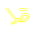

# Dango 
Dango is a collection of functions that can be used with [Ebitengine](ebitengine.org)

## data.go - FS
### embedded file system
Commonly used function to load files from embedded file system
Example:
```
import "github.com/iatearock/dango"
//go:embed assets/*
var data embed.FS
vfs = dango.NewFS(data)

// example usage
img, err := vfs.GetImage("assets/images/red.png") // *ebiten.Image
ff, err := vfs.GetFontFace("assets/font/red.ttf") // font.Face
str, err := vfs.GetCSV("assets/csv/red.csv") // [][]string
byte, err := vfs.ReadFile("assets/csv/red.txt") // []byte
```

## camera
Adopted from ebiten camera example:
https://github.com/hajimehoshi/ebiten/tree/main/examples/camera

```
cam := &dango.Camera{}  // setup camera 
cam.SetViewPort(w, h)
cam.Update() // update when position/rotation/zoom/viewport change

spriteOp := &ebiten.DrawImageOptions{}  // init options, and then apply sprite's transformation to spriteOp
spriteOP.GeoM.Concat(cam.GeoM()) // multiply sprite's matrix to camera matrix
screen.Draw(sprite, spriteOp)

screenX, screenY := cam.WorldToScreen(worldX, worldY) // transform coordinates
```

## scene
Scene manager adopted from ebiten Block example
Handle transition between scenes that implement Update() and Draw(*ebiten.Image)


## id
Simple unique id generator, concurrency safe, I think.

## bitmasks 
bits.go provide bitmask functions with mutex lock
Example:
```
const {
	s1 = 1 << iota
	s2
	s3
    s4
}

b = NewBits()
b.Set(s2|s3)
b.Has(s1|s2)  // true, matched any bit
b.HasAll(s1|s2) // false, need to match all bits
 ```

 ## Neon light 
Add neon light effect to an image

Neon adds color `c` within `light` pixels away from any pixels
with 255 for alpha channel.
Gaussian blur is applied with sqaure of width `blur`, and `sigma`
as Gaussian standard deviation
If `origin`, original image is draw on top of new image
If `resize`, new image will be larger due to Gaussian effect
on the edge
```
img := LoadPNG("input.png") // import a png file to *image.RGBA

d := 2 // add colour up to 2 pixels aways, from existing pixel with 255 in alpha channel
k := 3 // 3x3 kernal size for Gaussian blurring
s := 1 // standard deviation for Gaussian kernal
yellow := color.RGBA{255,255,0,255}
origin := true // draw original image on top of the result
resize := false // remove edge pixel produced by the Gaussin kernal, i.e. false to return same image size as the input

dango.Neon(img, d, k, s, yellow, origin, resize)
```
Input image:
Result image:
